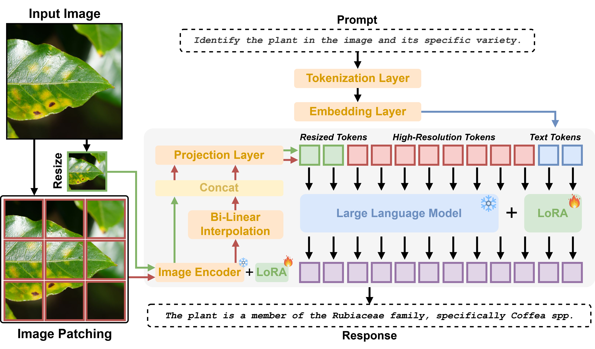

#  AgriChat: A Multimodal Large Language Model for Agriculture Image Understanding

<p align="center">
  <strong>Abderrahmene Boudiaf, Irfan Hussain, Sajid Javed</strong><br>
  Department of Computer Science, Khalifa University of Science and Technology, Abu Dhabi, UAE
</p>

<p align="center">
  A specialized Multimodal Large Language Model (MLLM) for fine-grained plant species identification, plant disease diagnosis, and crop counting.
</p>

<p align="center">
  <a href="#"></a>
  <a href="https://huggingface.co/boudiafA/AgriChat/tree/main/dataset"></a>
  <a href="https://huggingface.co/boudiafA/AgriChat/tree/main/weights/AgriChat"></a>
</p>

---

## 📢 Latest Updates

- **[2026-03-14]**: AgriChat-7B weights released on Hugging Face
- **[2026-03-14]**: AgriMM train/test annotation splits released on Hugging Face
- **[2026-02-26]**: AgriChat paper submitted to *Computers and Electronics in Agriculture*
- **[2026-02-25]**: Repository created

---

## 🌟 Overview

<p align="center">
  
</p>

**AgriChat** is a domain-specialized Multimodal Large Language Model (MLLM) designed for interactive agricultural diagnostics. Built on the [LLaVA-OneVision](https://github.com/LLaVA-VL/LLaVA-NeXT) architecture, AgriChat employs an **adaptive resolution (AnyRes) strategy** to preserve native pixel information up to **1344×1344** resolution — critical for resolving fine-grained visual features such as early-onset lesions, subtle phenotypic traits, and individual crop units. The model uses a **SigLIP-SO400M** vision encoder and a **Qwen-2-7B** language decoder, adapted to agriculture via parameter-efficient **LoRA** fine-tuning on our proposed AgriMM dataset.

### Why AgriChat?

General-purpose MLLMs lack the verified domain expertise to reason reliably across diverse plant taxonomies. AgriChat addresses this by:

- Training on **607,125 VQA pairs** grounded in verified phytopathological literature (not hallucinated by frozen LLMs)
- Covering **3,000+ agricultural classes** — the widest taxonomic diversity of any agricultural MLLM to date
- Running in **~2.3 seconds** on consumer-grade hardware (RTX 3090), enabling real-time field deployment

---

## 🏆 Key Contributions

1. **AgriMM Dataset**: The largest publicly available agricultural VQA benchmark — **121,425 images** and **607,125 QA pairs** spanning **3,099 classes** across **63 source datasets**, covering fine-grained species identification, disease diagnosis, and crop counting.

2. **Vision-to-Verified-Knowledge (V2VK) Pipeline**: A novel 3-stage data synthesis framework that integrates visual captioning with web-augmented scientific retrieval, eliminating biological hallucinations by grounding training data in verified literature.

3. **AgriChat Model**: The first agricultural MLLM fine-tuned on such a broad and diverse corpus, achieving state-of-the-art performance on four agriculture benchmarks and demonstrating superior zero-shot generalization over larger open-source generalist models.

---

## 📂 AgriMM Dataset

<p align="center">
  
</p>

**AgriMM** consolidates **63 source datasets** into a unified benchmark of **121,425 images** and **607,125 instruction-following QA pairs**. It is the first publicly available, multi-source agricultural VQA benchmark integrating fine-grained taxonomy, counting, and web-verified knowledge.

### Annotation Release

We release the **train** and **test** annotation splits on Hugging Face under the [dataset folder](https://huggingface.co/boudiafA/AgriChat/tree/main/dataset).

These JSONL files contain **annotations only**. The source images are not redistributed in this repository. Each record references an image path inside a user-created `datasets_sorted/` directory, for example:

```text
datasets_sorted\iNatAg_subset\hymenaea_courbaril\280829227.jpg
```

Users must download the original source datasets listed in Appendix A of the paper and recreate the corresponding dataset folders under `datasets_sorted/`.

### Dataset Components

| Component | Images | Classes | Description |
|-----------|--------|---------|-------------|
| Fine-Grained Identification | 48,580 | 2,956 species | Sourced from iNatAg; 9 taxonomic categories |
| Disease Classification | 49,348 | 110 diseases | 29 datasets across 33 major crops |
| Crop Counting & Detection | 23,497 | 33 crops | 33 detection datasets with bounding-box-derived counts |

### Vision-to-Verified-Knowledge (V2VK) Pipeline

Our pipeline ensures scientific accuracy through three stages:

1. **Stage I — Visual Grounding**: Gemma 3 (12B) generates structured image captions directly from the image input, extracting growth stage, planting density, and environmental context without relying on label-conditioned prompts.
2. **Stage II — Knowledge Retrieval**: Gemini 3 Pro with Google Search grounding retrieves verified botanical descriptions, disease etiology, and management protocols from authoritative sources.
3. **Stage III — Instruction Synthesis**: LLaMA 3.1-8B-Instruct synthesizes both the visual caption and retrieved knowledge into 5 diverse QA pairs per image (Identification, Visual Reasoning, Health Condition, Cultivation Knowledge, Quantification).

### 📥 Download

| Resource | Link |
|----------|------|
| AgriMM Train/Test Annotations (JSONL only) | [Hugging Face - dataset folder](https://huggingface.co/boudiafA/AgriChat/tree/main/dataset) |
| Source Dataset List | See Appendix A in the paper |

---

## 🧠 Model

<p align="center">
  
</p>

AgriChat is adapted for high-precision agricultural diagnostics based on LLaVA-OneVision. Input images are split into native-resolution local patches and a resized global thumbnail via an adaptive grid strategy, then encoded by **SigLIP-SO400M** equipped with LoRA adapters. The resulting visual tokens are projected into the language embedding space via a two-layer MLP and concatenated with text instruction tokens. The fused sequence is processed by the **Qwen-2-7B** decoder (also LoRA-adapted) to generate verifiable diagnostic responses. All pre-trained weights remain frozen — only the lightweight LoRA adapters and the projection layer are trained, enabling domain specialization on a single consumer GPU.

### Architecture

| Component | Model | Details |
|-----------|-------|---------|
| Vision Encoder | SigLIP-SO400M | 384×384 native tile resolution, LoRA rank=32, α=64 |
| Cross-Modal Projector | 2-layer MLP | Projects d_v=1152 → d_llm=3584 |
| Language Decoder | Qwen-2-7B | LoRA rank=128, α=256 |
| Max Resolution | 1344×1344 | Via adaptive grid (up to 12 tiles) |

### Performance Summary

AgriChat vs. state-of-the-art generalist baselines (METEOR / LLM Judge scores):

| Benchmark | LLaVA-OneVision (7B) | Llama-3.2 (11B) | Qwen-2.5 (7B) | **AgriChat (7B)** |
|-----------|---------------------|-----------------|---------------|-------------------|
| AgriMM | 37.89 / 55.12 | 32.43 / 57.18 | 29.11 / 65.77 | **66.70 / 77.43** |
| PlantVillageVQA | 17.25 / 57.41 | 6.72 / 54.44 | 3.43 / 53.21 | **19.52 / 74.26** |
| CDDM (Diagnosis) | 17.17 / 55.53 | 18.63 / 53.03 | 18.11 / 59.51 | **39.59 / 69.94** |
| AGMMU (MCQs) | 8.88 / — | 28.06 / — | 31.70 / — | **63.87 / —** |

### Inference

| Metric | Value |
|--------|-------|
| Avg. Inference Time | 2.315 seconds |
| Memory (4-bit quantized) | 10.71–12.32 GB |
| Throughput | ~1,555 queries/hour |
| Hardware | NVIDIA RTX 3090 (24GB) |

### 📥 Download

| Model | Base | Link |
|-------|------|------|
| AgriChat-7B | LLaVA-OneVision / Qwen-2-7B | [Hugging Face - model weights](https://huggingface.co/boudiafA/AgriChat/tree/main/weights/AgriChat) |

---

## 🔧 Installation

Start with the minimal inference setup below, then use the task-specific environments for auto-annotation and evaluation as needed.

### Quickstart: Inference Only

### Step 1: Clone Repository

```bash
git clone https://github.com/boudiafA/AgriChat.git
cd AgriChat
export PYTHONPATH="./:$PYTHONPATH"
```

### Step 2: Create the Inference Environment

```bash
conda create -n agrichat-infer python=3.10 -y
conda activate agrichat-infer

# PyTorch with CUDA 12.1
pip install torch==2.4.0 torchvision==0.19.0 torchaudio==2.4.0 --index-url https://download.pytorch.org/whl/cu121

# If you need CUDA 11.8 instead, use:
# pip install torch==2.3.1 torchvision==0.18.1 torchaudio==2.3.1 --index-url https://download.pytorch.org/whl/cu118

pip install --upgrade transformers accelerate bitsandbytes pillow protobuf peft
```

### Step 3: Place AgriChat Weights

```bash
weights/AgriChat/
├── adapter_config.json
└── adapter_model.safetensors
```

The repository does **not** include `adapter_model.safetensors` because the model weights are too large for a normal GitHub code release. Download the published weights from the model link above and place them in this folder.

### Step 4: Run a Minimal Inference Example

```bash
python scripts/inference_AgriChat_lora.py \
    --image path/to/image.jpg \
    --prompt "What is shown in this image?"
```

Very short Python example:

```python
from scripts.inference_AgriChat_lora import load_model, run_inference

model, processor = load_model()
response = run_inference(
    model=model,
    processor=processor,
    image_path="path/to/image.jpg",
    prompt="What is shown in this image?",
)
print(response)
```

### Task-Specific Environments

We recommend keeping the rest of the tooling isolated in separate environments:

- `agrichat-infer` for inference and the chatbot
- `agrichat-autoanno` for the auto-annotation pipeline
- `agrichat-eval` for `nlg_evaluator.py`
- `agrichat-judge` for `llm_judge.py`

### Environment 1: `agrichat-infer`

Use this for:
- `scripts/inference_AgriChat_lora.py`
- `scripts/chatbot_AgriChat_lora.py`

```bash
conda create -n agrichat-infer python=3.10 -y
conda activate agrichat-infer

pip install torch==2.4.0 torchvision==0.19.0 torchaudio==2.4.0 --index-url https://download.pytorch.org/whl/cu121
pip install --upgrade transformers accelerate bitsandbytes pillow protobuf peft gradio
```

### Environment 2: `agrichat-autoanno`

Use this for:
- `scripts/auto_annotation_pipeline.py`

This environment can reuse the same stack as `agrichat-infer`, but a separate environment keeps API and pipeline dependencies isolated.

```bash
conda create -n agrichat-autoanno python=3.10 -y
conda activate agrichat-autoanno

pip install torch==2.4.0 torchvision==0.19.0 torchaudio==2.4.0 --index-url https://download.pytorch.org/whl/cu121
pip install --upgrade transformers accelerate bitsandbytes pillow protobuf peft google-genai tqdm
```

### Environment 3: `agrichat-eval`

Use this for:
- `scripts/nlg_evaluator.py`

```bash
conda create -n agrichat-eval python=3.10 -y
conda activate agrichat-eval

pip install torch==2.4.0 torchvision==0.19.0 torchaudio==2.4.0 --index-url https://download.pytorch.org/whl/cu121
pip install --upgrade \
    transformers pillow tqdm \
    nltk rouge-score bert-score sentence-transformers scipy scikit-learn
```

Install Long-CLIP separately for `nlg_evaluator.py`:

```bash
git clone https://github.com/beichenzbc/Long-CLIP.git ../Long-CLIP
export LONGCLIP_ROOT="$(cd ../Long-CLIP && pwd)"
```

Then place the Long-CLIP checkpoint (for example `longclip-L.pt`) under:

```bash
$LONGCLIP_ROOT/checkpoints/
```

If `LONGCLIP_ROOT` is not set, the evaluator falls back to `../Long-CLIP` relative to this repository layout.

### Environment 4: `agrichat-judge`

Use this for:
- `scripts/llm_judge.py`

```bash
conda create -n agrichat-judge python=3.10 -y
conda activate agrichat-judge

pip install vllm transformers
```

Optional for training:
```bash
# The fine-tuning script defaults to flash_attention_2.
# Install FlashAttention if it matches your CUDA/PyTorch stack, or run training with:
#   --attn-implementation sdpa
pip install flash-attn --no-build-isolation
```

---

## 🛠️ Scripts

The `scripts/` directory contains all tools for fine-tuning, inference, evaluation, and interactive deployment of AgriChat.

### `auto_annotation_pipeline.py` — AgriMM Auto-Annotation Pipeline

Implements the full **Vision-to-Verified-Knowledge (V2VK)** data generation workflow used to build AgriMM. The pipeline is intentionally modular: the public entrypoint is `auto_annotation_pipeline.py`, while the three stages live under `scripts/auto_annotation_utils/` as separate utility modules for cleaner maintenance and easier extension.

**Pipeline stages:**

| Stage | Utility Module | Role |
|-------|----------------|------|
| I | `captioning_stage.py` | Generates grounded image-only captions with Gemma 3 (12B) |
| II | `knowledge_stage.py` | Produces class-level verified knowledge with Gemini 3 Pro + Google Search grounding |
| III | `qa_generation_stage.py` | Synthesizes structured QA pairs with Llama 3.1 |

**Expected dataset layout:**
```text
dataset/images/
├── class_a/
│   ├── image_001.jpg
│   └── ...
└── class_b/
    └── ...
```

**Generated outputs:**

| File | Description |
|------|-------------|
| `stage1_captions.jsonl` | Per-image visual captions |
| `stage2_class_knowledge.jsonl` | Per-class knowledge records |
| `stage3_qa_pairs.jsonl` | Final per-image QA annotations |

**Usage:**
```bash
# Full pipeline
python scripts/auto_annotation_pipeline.py \
    --image-root ./dataset/images \
    --output-dir ./auto_annotation_outputs \
    --resume

# Only knowledge retrieval and QA synthesis
python scripts/auto_annotation_pipeline.py \
    --image-root ./dataset/images \
    --output-dir ./auto_annotation_outputs \
    --stages knowledge qa \
    --resume
```

**Key CLI arguments:**

| Argument | Description |
|----------|-------------|
| `--image-root` | Root folder containing the dataset images |
| `--output-dir` | Directory where stage outputs will be written |
| `--stages` | Subset of stages to run: `captions`, `knowledge`, `qa` |
| `--resume` | Continue from existing JSONL outputs instead of regenerating completed records |
| `--class-names-file` | Optional text file with one class name per line for Stage II |
| `--caption-model` | Gemma model used for Stage I captioning |
| `--knowledge-model` | Google GenAI model used for Stage II knowledge generation |
| `--qa-model` | Llama-style text model used for Stage III QA synthesis |

**Notes:**
- Stage I uses image input only; it does not require class labels as prompt input.
- Stage II requires the Google GenAI SDK and a valid `GEMINI_API_KEY`.
- The Stage II utility is configured to call Gemini 3 Pro with Google Search grounding enabled.
- Stage I and Stage III assume GPU-backed inference for practical runtime.
- The pipeline writes JSONL incrementally, so interrupted runs can be resumed safely.

---

### `finetune_AgriChat_lora.py` — LoRA Fine-Tuning

Fine-tunes `llava-onevision-qwen2-7b-ov-hf` using LoRA adapters applied simultaneously to the SigLIP vision encoder (rank 32) and the Qwen2 LLM backbone (rank 128). This clean script is derived from our `run2_vision_llm_lora.py` training code in the ablation study folder. Only assistant turns are supervised; user turns are masked with `-100`. Supports automatic resumption from the latest checkpoint.

If FlashAttention is unavailable on your system, run the script with `--attn-implementation sdpa`.

**Key CLI arguments**:

| Argument | Description |
|----------|-------------|
| `--train-jsonl` | Training JSONL file |
| `--eval-jsonl` | Optional evaluation JSONL file |
| `--image-root` | Root directory containing image files |
| `--output-dir` | Directory for checkpoints and logs |
| `--agrichat-weights-dir` | Directory where the final AgriChat weights will be exported |
| `--lora-rank` / `--lora-alpha` | LoRA rank/alpha for the LLM backbone |
| `--vision-lora-rank` / `--vision-lora-alpha` | LoRA rank/alpha for the vision encoder |

**Usage:**
```bash
# Single GPU
python scripts/finetune_AgriChat_lora.py \
    --train-jsonl ./data/stage2_train.jsonl \
    --eval-jsonl ./data/stage2_test.jsonl \
    --image-root ./dataset/images \
    --output-dir ./finetune_output \
    --agrichat-weights-dir ./weights/AgriChat

# Multi-GPU
torchrun --nproc_per_node=<N_GPUS> scripts/finetune_AgriChat_lora.py \
    --train-jsonl ./data/stage2_train.jsonl \
    --eval-jsonl ./data/stage2_test.jsonl \
    --image-root ./dataset/images \
    --output-dir ./finetune_output \
    --agrichat-weights-dir ./weights/AgriChat
```

---

### `inference_AgriChat_lora.py` — Single-Image Inference

Loads the base LLaVA-OneVision model with the released AgriChat weights and runs single-image inference given an image path and a text prompt.

**Usage:**
```bash
python scripts/inference_AgriChat_lora.py \
    --image  path/to/image.jpg \
    --prompt "What disease is affecting this crop?" \
    --agrichat-weights ./weights/AgriChat
```

**CLI Arguments:**

| Argument | Description | Default |
|----------|-------------|---------|
| `--image` | Path to the input image | required |
| `--prompt` | Text question to ask about the image | required |
| `--agrichat-weights` | Path to the AgriChat weights directory | `./weights/AgriChat` |
| `--base-model` | HuggingFace base model ID | `llava-hf/llava-onevision-qwen2-7b-ov-hf` |
| `--max-tokens` | Maximum new tokens to generate | `512` |
| `--device` | Device: `cuda`, `cpu`, or `auto` | `auto` |

---

### `chatbot_AgriChat_lora.py` — Interactive Gradio Chatbot

Launches a web-based multi-turn chatbot with optional image uploads. The model is loaded once at startup in 4-bit NF4 quantization to minimise GPU memory usage. Generation parameters (temperature, top-p, top-k, repetition penalty) are adjustable via the UI.

**Usage:**
```bash
python scripts/chatbot_AgriChat_lora.py
# Then open http://localhost:7860
```

**Key configuration constants** (editable at the top of the script):

| Constant | Description |
|----------|-------------|
| `BASE_MODEL_ID` | HuggingFace model ID for the base model |
| `AGRICHAT_WEIGHTS_PATH` | Path to the AgriChat weights directory |
| `SERVER_PORT` | Port to serve the Gradio app (default: `7860`) |
| `SHARE` | Set to `True` to generate a public Gradio share link |

---

### `nlg_evaluator.py` — NLG Evaluation Suite

Evaluates model text outputs against ground-truth reference answers using a comprehensive set of lexical and semantic NLG metrics. Aligns predictions and references by matching the first image path in each sample's `"images"` field.

**Metrics computed:**

| Category | Metrics |
|----------|---------|
| Lexical | BLEU-4, ROUGE-2, METEOR |
| Semantic | BERTScore, LongCLIP Cosine, T5 Cosine, SBERT Cosine |

**Usage:**
```bash
export LONGCLIP_ROOT=/absolute/path/to/Long-CLIP

python scripts/nlg_evaluator.py \
    --model_output ./outputs/model_predictions.jsonl \
    --reference    ./data/test.jsonl \
    --longclip_ckpt $LONGCLIP_ROOT/checkpoints/longclip-L.pt \
    --output_json  ./results/scores.json
```

---

### `llm_judge.py` — LLM-as-a-Judge Evaluator

Uses **Qwen3-30B** (via vLLM) to score model outputs against ground-truth reference answers. Supports two evaluation modes detected automatically from the reference filename: **MCQ mode** (binary 0/1 scoring) and **open-ended mode** (1–4 Likert scale). Includes checkpoint support for resuming interrupted runs.

**Usage:**
```bash
python scripts/llm_judge.py \
    --model_output  path/to/model_predictions.jsonl \
    --reference     path/to/ground_truth.jsonl \
    --output        path/to/results.jsonl \
    --chunk_size    500 \
    --judge_model   Qwen/Qwen3-30B-A3B-Instruct-2507 \
    --tensor_parallel_size 1
```

**CLI Arguments:**

| Argument | Description | Default |
|----------|-------------|---------|
| `--model_output` | Path to model predictions JSONL | required |
| `--reference` | Path to ground-truth reference JSONL | required |
| `--output` | Path for scored output JSONL | `judged_<input_basename>` |
| `--chunk_size` | Prompts per vLLM batch | `500` |
| `--judge_model` | HuggingFace model ID for the judge LLM | `Qwen/Qwen3-30B-A3B-Instruct-2507` |
| `--tensor_parallel_size` | Number of GPUs for tensor parallelism | `1` |
| `--max_model_len` | Max token context length | `32768` |

**Expected JSONL format** (shared across all evaluation scripts):
```json
{
    "images": ["path/to/image.jpg"],
    "messages": [
        {"role": "user",      "content": "What disease is shown?"},
        {"role": "assistant", "content": "The image shows powdery mildew."}
    ]
}
```

---
## 📊 Evaluation

We employ a multi-faceted evaluation framework combining lexical, semantic, and LLM-based metrics:

| Category | Metrics |
|----------|---------|
| Lexical | BLEU-4, ROUGE-2, METEOR |
| Semantic | BERTScore, LongCLIP, T5 Cosine, SBERT |
| LLM-as-a-Judge | Qwen3-30B-A3B-Instruct (4-point Likert scale) |

Use the two provided evaluators directly:

```bash
# Lexical + semantic metrics
python scripts/nlg_evaluator.py \
  --model_output ./outputs/model_predictions.jsonl \
  --reference ./data/test.jsonl \
  --output_json ./results/nlg_scores.json

# LLM-as-a-Judge
python scripts/llm_judge.py \
  --model_output ./outputs/model_predictions.jsonl \
  --reference ./data/test.jsonl \
  --output ./results/judged_predictions.jsonl
```

---

## 📜 Citation

If you find our work useful, please cite:
```bibtex
@article{boudiaf2026agrichat,
  title     = {AgriChat: A Multimodal Large Language Model for Agriculture Image Understanding},
  author    = {Boudiaf, Abderrahmene and Hussain, Irfan and Javed, Sajid},
  journal   = {Submitted to Computers and Electronics in Agriculture},
  year      = {2026}
}
```

---

## 📄 License

This project is released under the [Apache 2.0 License](LICENSE).

The AgriMM dataset is released for **research purposes only**. Individual source datasets retain their original licenses; see Appendix A in the paper for the complete source list.

## 🙏 Acknowledgments

This work was supported by Khalifa University of Science and Technology, Abu Dhabi, UAE. We thank the creators of the 63 source datasets that make AgriMM possible.

## 📧 Contact

For questions or collaborations, please contact: **100058322@ku.ac.ae** (Abderrahmene Boudiaf)
